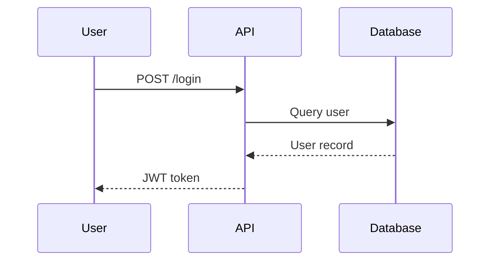

# 設計文件輸出格式

## 結構

1. **設計概述** — 一段話描述技術方案
2. **系統架構**（Mermaid classDiagram 或 flowchart）
3. **核心流程**（Mermaid sequenceDiagram）
4. **資料模型** — Entity 定義與關係
5. **API 設計** — Endpoint、Request/Response schema
6. **檔案結構** — 新增/修改的檔案清單
7. **錯誤處理策略**
8. **測試策略**
9. **已知限制與技術債**

## 範例

### Sequence Diagram


### 檔案結構
```
src/
├── auth/
│   ├── auth.controller.ts   # 新增
│   ├── auth.service.ts      # 新增
│   └── auth.guard.ts        # 新增
└── users/
    └── users.service.ts     # 修改：加入密碼驗證
```
